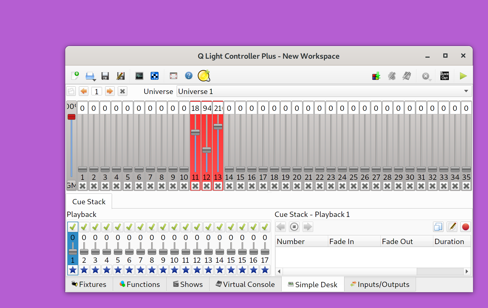

# QFullscreenArtNetChannel

Simple app to display 3 RGB ArtNet channels as fullscreen window.

This application listens for ArtNetDmx packets and extracts 3 channels to fill a fullscreen window with the RGB color.



The screenshot shows [QLC+](https://www.qlcplus.org/) in the foreground and the application in the background displaying the RGB color set by QLC+.

## Usage

```
Usage: QFullscreenArtNetChannel INTERFACE UNIVERSE CHANNEL
```

- `INTERFACE`: a name of a present network interface where the application will listen for packets
- `UNIVERSE`: an ArtNet universe ID (starting from zero)
- `CHANNEL`: the channel offset (starting from zero), the application will use the given channel and the two next for RGB values

```
./QFullscreenArtNetChannel lo 0 10
```

This will listen on the local interface at universe 0 and will use channels 10, 11, 12.

## Build

```bash
qmake
make
```
